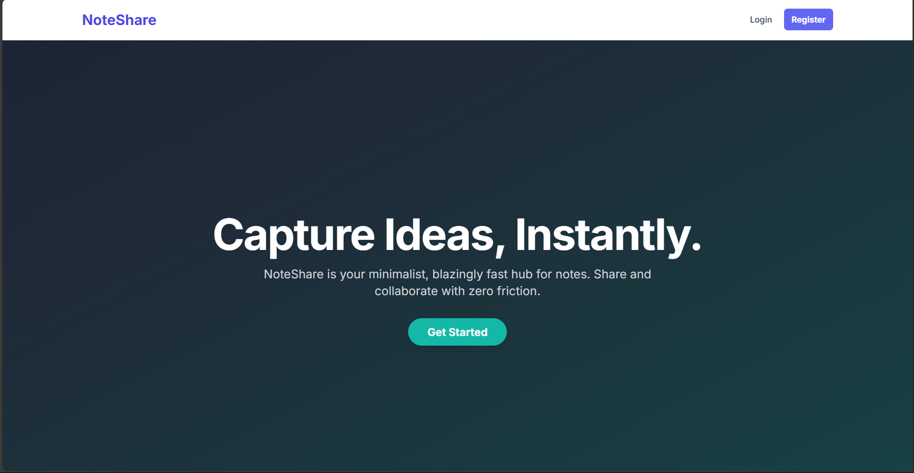

# NoteShare 

NoteShare is a modern, full-stack web application built with the MERN stack (MongoDB, Express, React, Node.js) and TypeScript. It provides a clean and intuitive user experience with a focus on speed, simplicity, and seamless collaboration.

---


<p align="center">
  
</p>


## Prerequisites

Before you begin, ensure you have the following installed on your system:

- [Node.js](https://nodejs.org/) (v16 or later recommended)
- [npm](https://www.npmjs.com/) (usually comes with Node.js)
- [Git](https://git-scm.com/)
- A **MongoDB Atlas** account for the database. You will need a connection string.

---

##  Setup and Installation

Follow these steps to get your local development environment set up.

### 1. Backend Setup

1.  **Navigate to the backend directory:**

    ```bash
    cd notes-app-backend
    ```

2.  **Install backend dependencies:**

    ```bash
    npm install
    ```

3.  **Create your environment file:**
    Create a new file named `.env` in the `notes-app-backend` root directory. Add the following content, replacing the placeholders with your actual credentials.

    ```env
    # MongoDB Atlas connection string (replace your-username, <password>, and your-db-name)
    MONGO_URI=mongodb+srv://your-username:<password>@cluster0.xxxxx.mongodb.net/your-db-name?retryWrites=true&w=majority

    # A long, random, and secret string for signing JWT tokens
    JWT_SECRET=your-very-strong-and-secret-key-for-jwt

    # The port the server will run on
    PORT=5001
    ```

### 2. Frontend Setup

1.  **Navigate to the frontend directory** (from the project's root folder):

    ```bash
    cd notes-app-frontend
    ```

2.  **Install frontend dependencies:**
    ```bash
    npm install
    ```

---

##  Running the Application

To run the application, you will need **two separate terminal windows** open simultaneously.

### Terminal 1: Start the Backend Server

```bash
# Navigate to the backend folder
cd notes-app-backend

# Start the server
npm run dev
```

### Terminal 2: Start the Frontend Development Server

```bash
# Navigate to the frontend folder
cd notes-app-frontend

# Start the development server
npm run dev
```
 Now the Application 
